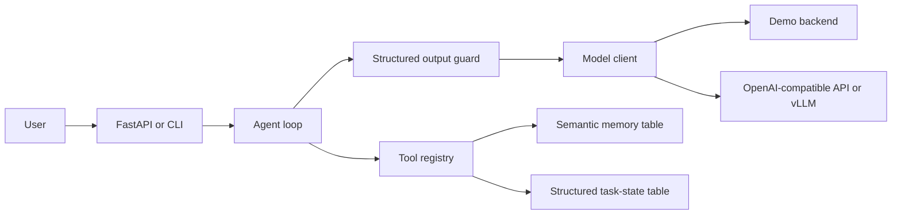

# Architecture

## Key Decisions

- Task state and semantic recall are separate because unfinished work is a
  state-tracking problem, not only a retrieval problem.
- Every model response must validate as an `AgentStep`. Invalid JSON gets one
  repair attempt and then a safe fallback.
- Every step records the raw model output, tool observation, repair count, and
  latency. The same trace powers debugging and eval assertions.
- The default demo backend is deterministic. Reviewers can run the core scenario
  without an API key or GPU, then switch to an OpenAI-compatible endpoint.

## Production Extensions

The checked-in MVP uses lexical retrieval over SQLite to remain self-contained.
The next production step is a Qdrant adapter with embedding cache, followed by
email-provider OAuth, background scheduling, and backend-specific eval runs.

